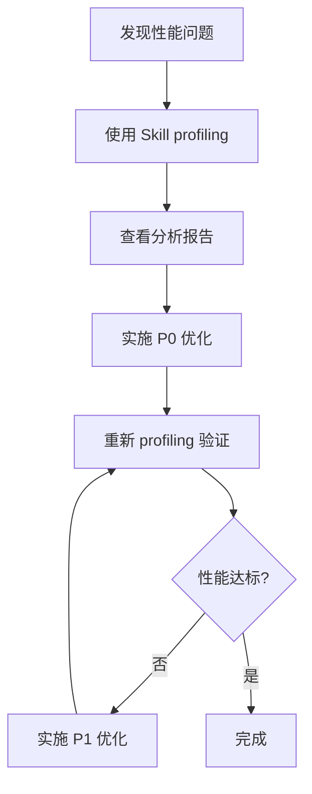

# Mooncake Profiler - 快速开始

## 最简单的用法

只需一句话：
```
帮我 profile 一下 mooncake 的 batch_get_tensor
```

Skill 会自动：
1. ✅ 运行性能测试
2. ✅ 添加 C++ profiling
3. ✅ 分析瓶颈
4. ✅ 生成优化建议

## 常见使用场景

### 场景 1: 初次性能诊断
**用户说**:
```
mooncake 的 GET 性能很差，帮我看看问题在哪
```

**Skill 会**:
- 运行完整的 profiling 流程
- 识别主要瓶颈（如 Merge tensors、Batch GET I/O）
- 提供分阶段优化建议
- 预估性能提升

**输出示例**:
```
✅ 发现问题:
   • GET 吞吐量: 8.72 Gb/s (远低于 PUT 的 21.44 Gb/s)
   • 主要瓶颈: Merge tensors 占用 29%
   • 次要瓶颈: Batch GET I/O 占用 49%

✅ 优化建议:
   P0: 优化 Merge 逻辑
       → 使用 zero-copy 策略
       → 预期性能提升: +40%

   P1: 增大 batch size + 异步并行
       → batch_size: 500 → 2000-5000
       → 并行发起多个 batch
       → 预期性能提升: +50%

📊 详细报告已生成: BATCH_GET_TENSOR_PROFILING_REPORT.md
```

### 场景 2: 验证优化效果
**用户说**:
```
我已经优化了 merge 逻辑，帮我重新 profile 看看提升了多少
```

**Skill 会**:
- 运行新的性能测试
- 与之前的 baseline 对比
- 验证优化是否生效

### 场景 3: 快速检查
**用户说**:
```
快速看一下当前的吞吐量，不用详细分析
```

**Skill 会**:
- 使用 `--quick` 模式
- 只运行基本测试
- 快速给出关键指标

## 支持的触发词

Skill 会在检测到以下关键词时自动激活：
- "profile mooncake"
- "分析 mooncake 性能"
- "benchmark batch_get_tensor"
- "mooncake 瓶颈"
- "优化 mooncake 吞吐量"
- "mooncake 很慢"
- "batch_get 性能问题"

## 参数说明

### 基本参数
```bash
/profile-mooncake                      # 使用默认配置
/profile-mooncake --quick              # 快速模式，跳过 C++ profiling
/profile-mooncake --config my.yaml    # 指定配置文件
```

### 高级参数
```bash
/profile-mooncake \
  --api batch_get_tensor \             # 指定 API
  --config mooncake_config.yaml \      # 配置文件
  --iterations 100 \                   # 测试迭代次数
  --keep-profiling                     # 保留 C++ profiling 代码
```

## 输出解读

### 关键指标

| 指标 | 说明 | 好的值 |
|------|------|--------|
| **GET Throughput** | 读取吞吐量 | >20 Gb/s |
| **PUT Throughput** | 写入吞吐量 | >20 Gb/s |
| **PUT/GET Ratio** | 对称性 | ~1.0 |
| **I/O Percentage** | I/O 占比 | 70-80% |

### 瓶颈类型

#### Python 层瓶颈
- **Merge tensors**: TensorDict 合并操作慢
  - **解决方案**: Zero-copy、预分配

- **Validation**: 数据验证开销大
  - **解决方案**: 生产环境禁用

#### C++ 层瓶颈
- **Metadata Query**: 元数据查询慢
  - **解决方案**: 缓存、预取

- **Batch GET I/O**: 网络传输慢
  - **解决方案**: RDMA、增大 batch size、异步并行

- **Buffer Allocation**: 内存分配慢
  - **解决方案**: 内存池、预分配

### 优化优先级判断

Skill 会自动按以下标准分配优先级：

- **P0 (紧急)**:
  - 占用时间 >30%
  - 实施难度低
  - 预期收益高

- **P1 (重要)**:
  - 占用时间 10-30%
  - 实施难度中等
  - 预期收益中等

- **P2 (可选)**:
  - 占用时间 <10%
  - 实施难度高
  - 预期收益低

## 典型工作流

### 第一次使用



### 持续优化

1️⃣ **Baseline**
```
profile mooncake
→ GET: 8.72 Gb/s
```

2️⃣ **实施 P0 优化**
```
优化 Merge 逻辑
```

3️⃣ **验证**
```
重新 profile
→ GET: 12.5 Gb/s (+43%)
```

4️⃣ **继续优化**
```
实施 P1: 异步并行
→ GET: 18.2 Gb/s (+45%)
```

## 常见问题

### Q: Skill 不自动激活怎么办？
**A**: 确保使用了触发关键词，如 "profile mooncake" 或直接使用命令 `/profile-mooncake`

### Q: 测试运行失败
**A**: 检查：
- mooncake_master 是否运行
- 配置文件路径是否正确
- 网络连接是否正常

### Q: 编译失败
**A**:
- 检查 C++ 编译器版本
- 查看错误信息中的具体问题
- 可以使用 `--quick` 模式跳过 C++ profiling

### Q: 想要 profile 其他 API
**A**: 目前 Skill 主要支持 batch_get_tensor，如需 profile 其他 API，可以参考生成的 C++ instrumentation 模式手动添加。

## 最佳实践

### ✅ DO

- 在实施优化前先运行 baseline profiling
- 每次优化后重新 profiling 验证效果
- 按优先级顺序实施优化（P0 → P1 → P2）
- 保存每次的报告用于对比

### ❌ DON'T

- 不要同时实施多个优化（难以判断哪个有效）
- 不要忽略小的瓶颈（累积效应）
- 不要在生产环境直接测试

## 进阶技巧

### 自定义 Profiling 点

如果需要 profile 特定的代码段，可以参考 Skill 添加的代码模式：

```cpp
auto start = std::chrono::high_resolution_clock::now();
// ... 你的代码 ...
auto end = std::chrono::high_resolution_clock::now();
double duration_ms = std::chrono::duration<double, std::milli>(end - start).count();
LOG(INFO) << "Custom operation took: " << duration_ms << " ms";
```

### 性能基准测试

建立性能基准数据库：

```bash
# 记录 baseline
/profile-mooncake --output baseline_2026-01-02.md

# 定期测试
/profile-mooncake --output weekly_test_$(date +%Y-%m-%d).md

# 对比分析
diff baseline_2026-01-02.md weekly_test_$(date +%Y-%m-%d).md
```

## 相关资源

- **详细报告示例**: `/workspace/mh/BATCH_GET_TENSOR_PROFILING_REPORT.md`
- **C++ 代码位置**: `/workspace/mh/Mooncake/mooncake-store/src/real_client.cpp`
- **测试脚本**: `/workspace/mh/TransferQueue/performance_test.py`
- **配置示例**: `/workspace/mh/TransferQueue/mooncake_config.yaml`

## 获取帮助

如果遇到问题，可以：
1. 查看详细报告中的故障排除章节
2. 检查 Mooncake 和 TransferQueue 文档
3. 查看生成的 C++ 代码了解 profiling 逻辑
